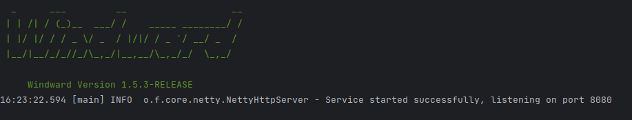

## Instruction
[中文](README.zh-CN.md)
<div style="text-align: center">


</div>

This project is driven by `Windward`, `Spring` as a DI container, `MongoDB` as a persistent storage implementation of
a `WebSocket` and `Protobuf` based
Instant messaging server. It is currently under development🐻‍❄️.

## Quick start

- package
  ```shell
    ./gradlew clean jar
  ```
- run
  ```shell
    java -jar build/libs/wim-0.1-SNAPSHOT.jar
  ```
- you get it

  